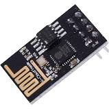
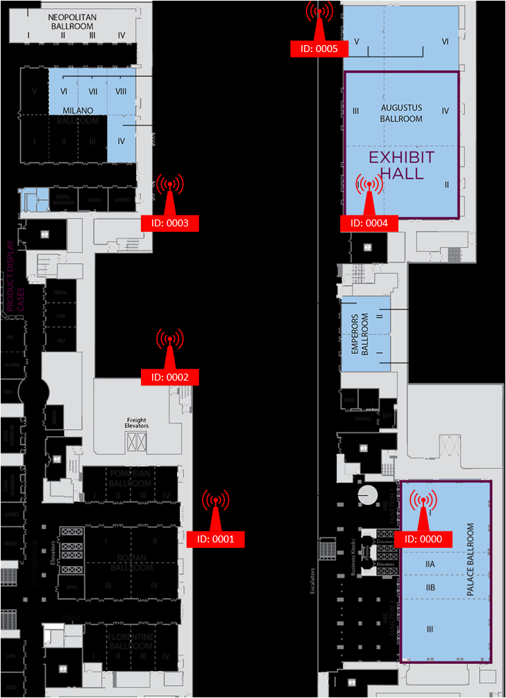

# DEF CON 26, Wireless CTF BSSID sensor network

## Background

DEF CON features a Wireless Village with a capture the flag (CTF) 
competition. 

This CTF offers Bluetooth, Traditional RF, and WiFi challenges. 

Each category contains a radio direction finding (RDF) challenge.

The WiFi variant comes in two flavors: Find the Fox, and Hide & Seek.

Find the Fox requires contestants to locate a wireless access point (AP) 
who's location constantly changes. Typically, this requires a human to 
carry an AP as the meander about the conference property (2017, Caesars 
Palace).

Hide & Seek follows the same principles as FtF, but is stationary, 
hidden someplace on the conference property. 

## Purpose

This software controls an ESP8266 and allows competitors to deploy a 
network of wireless sensors in the 2.4GHz range that report back to a 
central node with details about 
802.11 signals they receive.

## Concept

The spec for the ESP8266 can be found at the Wiki: https://github.com/esp8266/esp8266-wiki/wiki

[Datasheet](https://nurdspace.nl/ESP8266)

## TODO:

- Determine best way to handle distributed comms, i.e. set up in chain, unicast messages, synchronus, a-sync, etc.
- List limitations, i.e. power, storage, processor load, spatial limitations (steel, stone, skin)
- Plan deployment strategy, i.e. when to deploy, where, what...
- Integrate GPS
- Make every DC719 member a sensor
- Hand out sensors to DC26 attendees?
- RE DC badge to act as sensor?
- Drink
- Consider using a pi as a C2
- If we have the memory, we can use a python library such as https://github.com/pirate/mesh-networking, otherwise we'll go with something like hhttps://github.com/gmag11/painlessMesh (up to date) OR https://github.com/Coopdis/easyMesh
Links of Interest:
https://github.com/martin-ger/esp_wifi_repeater
https://github.com/gmag11/painlessMesh
https://gitlab.com/painlessMesh/painlessMesh/wikis/bridge-between-mesh-and-another-network
https://gitlab.com/painlessMesh/painlessMesh/wikis/home

